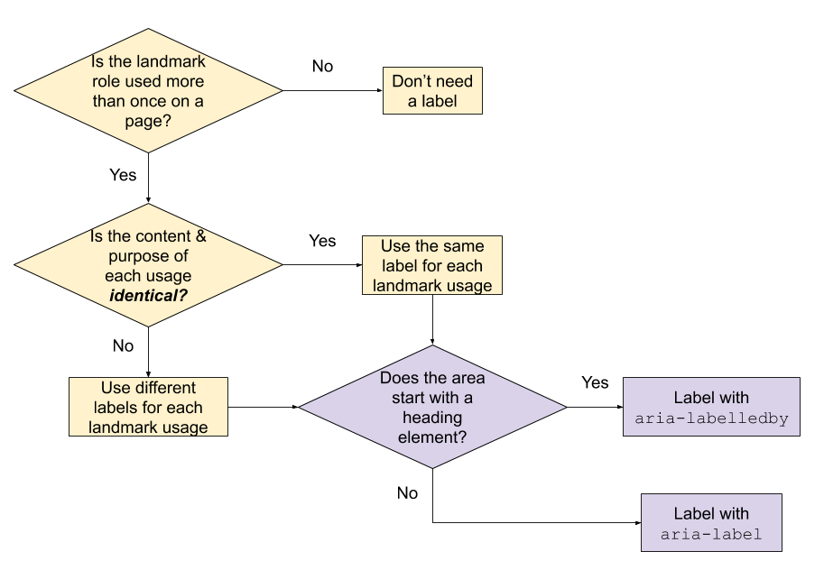

# Landmarks

## What Are They?

Markers used to identify the structure of a page.

* They're especially used by screen readers for navigation
* Landmarks can also be used as targets for skip links

## How Do I Add Them?

### Step 1: Identify the logical structure of your page

What are the perceivable areas of content on your page? Break down the contents of your page.

### Step 2: Assign landmark roles to each area

| HTML5 Element | Corresponding Landmark Role |
|---|---|
|`aside`* | `complementary` |
| `footer`* | `contentinfo` (when inside `<body>` |
| `header`* | `banner` (when inside `<body>` |
| `main`* | `main` |
| `nav` | `navigation` |
| `section` | `region` (when it has an accessible name**) |
| `form` | `form` (when it has an accessible name**) |

\* should be *top-level* landmarks  
\** such as `aria-label` or `aria-labelledby`

### Step 3: Label areas

#### How many labels are needed?

Top of flowchart begins Q: Is the landmark role used more than once on a page?

1. If "used once":
    1. Don't need a label
1. If "used more than once":
    1. Q: Is the content/purpose of each usage *identical*?
        1. If "yes":
            1. Use the same label
        1. If "no":
            1. Use different labels for each landmark usage
            
#### What kind of label should be used?

Q: Does the area start with a heading element?

1. If "yes":
    1. Label with `aria-labelledby` and the ID of the element
1. If "no":
    1. Label with `aria-label`

## Types of Landmarks

### `banner`
* WHAT
    * Header, with site-oriented content (e.g., logo, sponsor, site-specific search)
    * Typically one per page, at top of page, full-width
* HOW
    * HTML5: `<header>`
    * ARIA: `role="banner"`
    
### `complementary`
* WHAT
    * Supporting section of the page, which complements the main section *and* still has meaning when separated from main content
* HOW
    * HTML5: `<aside>`
    * ARIA: `role="complementary"`
    
### `contentinfo`
* WHAT
    * Footer, with copyrights, links to privacy and accessibility statements
    * Typically one per page, bottom of page
* HOW
    * HTML5: `<footer>`
    * ARIA: `role="contentinfo"`
    
### `form`
* WHAT
    * Collection of items/objects that combine to create a form when no other landmark roles are appropriate (e.g., main, search)
    * Should have controls that use semantic HTML (e.g., button, input, select, textarea)
* HOW
    * HTML5: `<form>` with accessible name (i.e., `aria-label`, `aria-labelledby`)
    * ARIA: `role="form"`
    
### `main`
* WHAT
    * Primary content of page
    * One per page
* HOW
    * HTML5: `<main>`
    * ARIA: `role="main"`
   
### `navigation`
* WHAT
    * Groups of links used for site or page navigation
    * If groups of links are identical for two navigation landmarks, use the same label
* HOW
    * HTML5: `<nav>`
    * ARIA: `role="navigation"`
    
### `region`
* WHAT
    * Perceivable section of the page containing content sufficiently important for users to be able to navigate to the section
    * Can be multiple per page
    * Can be used for sections/content that other landmarks don't fit
* HOW
    * HTML5: `<section>` with accessible name (i.e., `aria-label`, `aria-labelledby`, `title`)
    * ARIA: `role="region"`
    
### `search`
* WHAT
    * Collection of items/objects that combine to create search functionality
* HOW
    * HTML5: There is no HTML5 element that corresponds to the search role
    * ARIA: `role="search"`

## Example

Check out <landmarks-example.html> for an example of a page with basic landmarks.